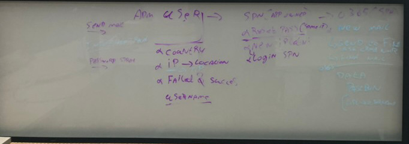

# SecureHats - UseCase

## Initial trigger

Tweet the link to GitHub that there has been data stolen #SecureHats
>- add file content on https://0bin.net/ and set expiry to 1 day
>- Preview https://0bin.net/paste/V3Qaoztd#BUyMa+RENCr-cPKqNTqlsvgSRY3KkamTfXEeUls0hPY

## Access to first clue
Hacker uploads a file to GitHub, there is a mail address assigned to the GitHub user. Use this mail address for the next step.
> define flag

Go to office activity and see if there is anything found based on the mail address
> define flag
Here you will find the forward rule based on the mail address found on GitHub
> define flag
-	here we can mislead the investigator they will focus on ip address but will find nothing
> define flag
Based on the SPN that created the forward rule, find all the SPN activities. Here you see that there was a password created by user xxx@domain.nl. Now we have the stolen user account.
> define flag
Find when and from where the user was hacked
> define flag

# UseCase

Tweet the link to GitHub that there has been data stolen using the tag #SecureHats
>- **_Optional:_** add file content on https://0bin.net/ and set expiry to 1 day
>- Preview https://0bin.net/paste/V3Qaoztd#BUyMa+RENCr-cPKqNTqlsvgSRY3KkamTfXEeUls0hPY

Hacker uploads a file to GitHub, there is a mail address assigned to the GitHub user. Use this mail address for the next step.

Go to office activity and see if there is anything found based on the mail address

Here you will find the forward rule based on the mail address found on GitHub

-	here we can mislead the investigator they will focus on ip address but will find nothing

Based on the SPN that created the forward rule, find all the SPN activities. Here you see that there was a password created by user xxx@domain.nl. Now we have the stolen user account.

Find when and from where the user was hacked

## Diagram draft

